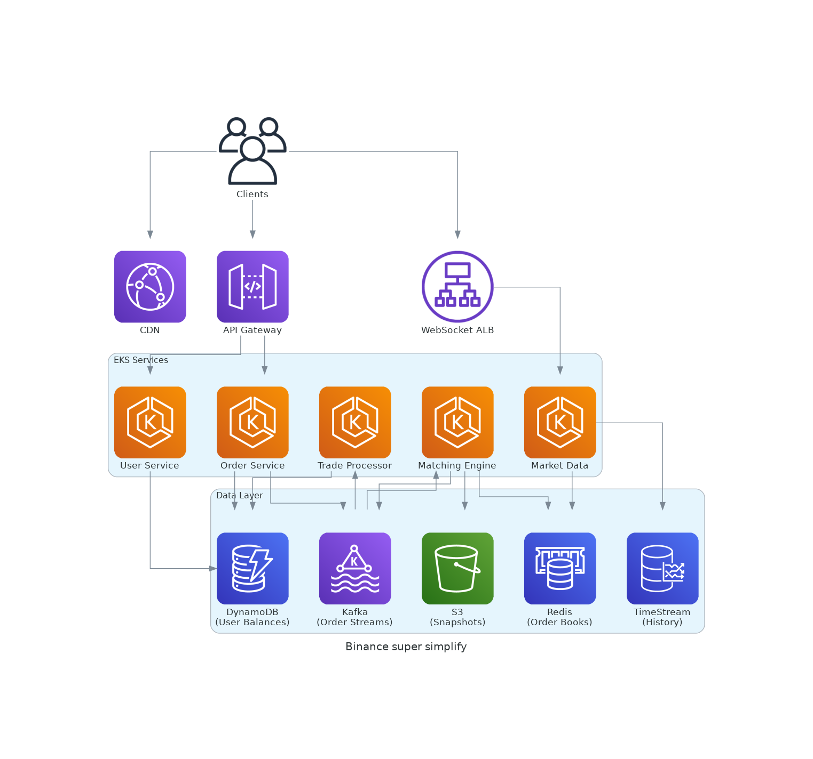

# Trading system design overview

## Scenario

Designing a high available trading platform like Binance. 

When user go to binance, first they will see a marketplace with multiple trading pair, with each pair pricing update continously, indicate that data is broadcasting to client through websocket. 
When user want to trade, they will need to authenticate to the system. After that, user will book an order based on their availability, when order book is confirmed success, new amount is existed on user wallet. This is a simplity process of what trading system like binance doing.

### Core Services of a Trading Platform

#### Backend Services

As a standard way to deploy container service, support high availability, faul tolerance, easy to scale up or down depend on traffic. I choose AWS EKS as container orchestration, it can also use spot instance on non critical service to reduce the cost.

Alternative is AWS ECS with EC2 or Fargate.

1. User Service  
Role: Manages user accounts, authentication, and authorization.
2. Order Service
Role: Handles order creation, validation, and routing.
3. Marching Engine service
Role: Matches buy/sell orders in real-time.
4. Market Data Service
Role: Aggregates and distributes real-time market data.
5. Trade Processing Service
Role: Finalizes executed trades.

#### Infrastructure and Frontend services 
1. AWS API Gateway
2. AWS ALB
3. CloudFront
4. WAF
Cloudfront distribute static to client on edge, help reduce latency. Request from client will be routed to backend services through AWS ALB and gateway, with help from AWS WAF for security.

Alternative: deploy self-managed API Gateway like traefik, apisix. And use cloudflare to host dns, caching on edge. This solution is cheaper than AWS services but come with self-managed problem.

#### Data layer
1. Redis holds order books.
2. AWS managed kafka streams orders/trades.
3. DynamoDB stores balances and orders.

These services is highly fault-tolerance and scalability, especially with kafka and dynamodb. With correct Dynamodb setup, it's highly scalable and cheap.
Kafka and DynamoDB throughput are far exceed 500 read,write/sec so it can easily overcome 500 requests per second.

Altenative: Rabbit MQ, AWS Aurora DB

#### Latency breakdown

| Component                | p99 Latency Target |
|--------------------------|--------------------|
| API Gateway/ALB          | 5ms                |
| Order Validation (DynamoDB) | 10ms               |
| Kafka Produce            | 5ms                |
| Matching Engine          | 50ms               |
| Trade Processing         | 20ms               |
| Total                    | 90ms               |

### Diagram Overview

### Plan for scaling
1. Setup cloudwatch for logging, monitoring and alerting.
2. Setup hpa auto scaler for service in EKS, add more node with better perfomance.
3. Scale up kafka cluster, redis with better instance.
